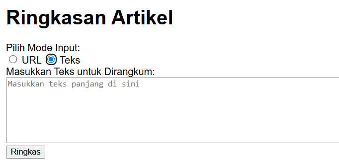
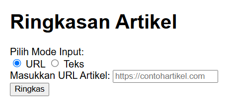
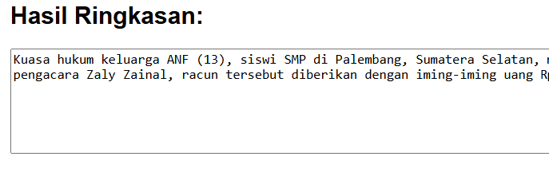
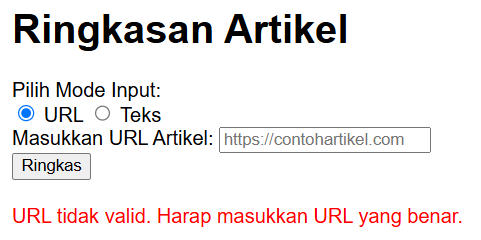

Menggunakan Model T5 untuk Merangkum Artikel Secara Otomatis
**Penulis:** Kiagus Ryshad Kamal
**Tanggal:** 15/12/2024

## Deskripsi Proyek
Proyek ini bertujuan untuk menyediakan aplikasi web yang dapat merangkum artikel berita atau teks dari URL atau input teks langsung. Dengan menggunakan Flask sebagai framework backend dan model T5 untuk merangkum teks, aplikasi ini membantu pengguna memahami inti dari artikel panjang dalam waktu singkat.

## Fungsi dan Fitur
1. **Input URL**: Pengguna dapat memasukkan URL artikel untuk dirangkum.  
2. **Input Teks Langsung**: Pengguna juga dapat memasukkan teks panjang untuk dirangkum.  
3. **Validasi URL**: Aplikasi memverifikasi apakah URL yang dimasukkan valid.  
4. **Output Ringkasan**: Menyediakan ringkasan singkat dengan opsi tampilan teks atau link aktif.  
5. **Antarmuka Sederhana**: Desain antarmuka yang minimalis dan mudah digunakan.

## Mendemonstrasikan Cara Kerja
Berikut adalah beberapa tangkapan layar aplikasi:
### Form Input Teks

### Form Input URL

### Hasil Ringkasan

### Pesan Error


## Cara Instalasi dan Menggunakan Proyek
### Instalasi
1. **Clone repository**:  
   ```bash
   git clone https://github.com/username/proyek-ringkasan.git
2. **Masuk ke direktori proyek**:
   cd proyek-ringkasan
3. **Install dependencies**:
   pip install -r requirements.txt
### Menjalankan Aplikasi
1. **Jalankan aplikasi**:
   python app.py
2. **Buka browser dan akses**:
   http://127.0.0.1:5000

### Umpan Balik
   Kami menghargai masukan dan saran Anda! Silakan:
   **Ajukan issue di**: repository ini.
   **Kirim email ke**: kiagusryshad@gmail.com
   
### Kesimpulan
   Proyek ini mempermudah pengguna untuk memahami artikel panjang secara cepat. Dengan pengembangan lebih lanjut, aplikasi ini dapat diperluas untuk berbagai          keperluan lainnya.
